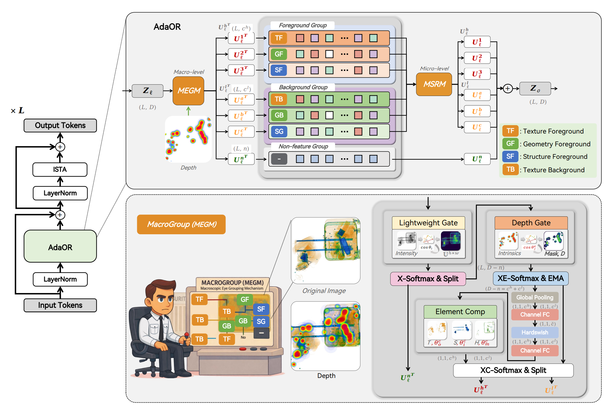

# 🧠 AdaOR: Oculomotor-Guided Perceptual Reconstruction for Extreme Sparse-View 3D Imaging

<div align="center">
    
</div>

---

## 📘 Overview

**AdaOR** is a biologically interpretable 3D reconstruction framework designed for **real-time, transparent, and efficient X-ray image reconstruction**.  
Inspired by the **hierarchical organization of the human visual cortex** and **oculomotor control mechanisms**, AdaOR reorganizes Gaussian-based volumetric reconstruction into a multi-stage perception pipeline that mimics human visual processing—from low-level pixel perception to high-level semantic integration.

---

## 🧩 Key Innovations

### 1️⃣ Hierarchical Visual Pipeline (V1 → IT)
AdaOR follows a **four-stage cortical architecture** mirroring the human brain’s visual hierarchy:

| Stage | Biological Analogy | Function | Implementation |
|--------|--------------------|-----------|----------------|
| **V1** | Primary Visual Cortex | Pixel completion & edge refinement | CNN-based low-level encoder |
| **V2/V3** | Intermediate Visual Areas | Structural inference & geometry understanding | Transformer attention |
| **V4** | Higher Visual Area | Semantic abstraction | Mamba–Transformer hybrid |
| **IT** | Inferior Temporal Cortex | Holistic feature integration | Global aggregation network |

---

### 2️⃣ Macroscopic Eye Grouping Mechanism (MEGM)
Simulates **material-aware eye movement priors**, grouping channels dynamically to **enhance correlation reliability** and **suppress redundant activations**.

---

### 3️⃣ Microscopic Saccadic-like Rhythm Mechanism (MSRM)
Introduces a **sub-quadratic Mamba–Transformer hybrid** mimicking micro eye movements:
- 🌀 *Saccade*: Rapid focus shifts  
- 🔍 *Fixation*: Stable observation  
- 🌫️ *Microsaccade*: Fine-grained detail refinement  
- ♻️ *Re-entry*: Recurrent semantic attention  

This rhythm improves reconstruction robustness under **occlusion, structural ambiguity, and heterogeneous materials**.

---

## 🧮 Architecture Overview

The AdaOR architecture integrates **BioEyeFusion Encoders**, **Cross-attentive X-ray Upsampler**, and **Gaussian Fusion Heads** for adaptive multi-view feature alignment and reconstruction.

```
Macro (V1 → V2/V3 → V4 → IT)
├── BioEyeFusion Encoder (shared weights)
├── X-ray Upsampler (cross-attention upsampling)
└── Gaussian Fusion (µ, Σ, Z, ρₑ)
```

### 🧠 System Components
- **BioEyeFusion Encoder** – parallel dual-view encoder with cross-scale interaction
- **X-ray Upsampler** – hierarchical upsampling block with learnable FFT-based correlation
- **Gaussian Center & Param Heads** – reconstruct structural and radiometric Gaussian fields

---

## ⚡ Performance Highlights

| Metric | Improvement | Description |
|--------|--------------|--------------|
| **PSNR** | +7.29 dB | Higher reconstruction fidelity |
| **Runtime** | ↓ 49 seconds | Nearly **9× speedup** vs. Gaussian-Splatting baselines |
| **Interpretability** | ✓✓✓ | Biologically grounded architecture |

---

## 🚀 Installation

```bash
git clone https://github.com/yourusername/AdaOR.git
cd AdaOR
pip install -r requirements.txt
```

If you use Poetry:
```bash
poetry install
```

---

## 🧩 Usage

### Train
```bash
python src/main.py --config config/main.yaml --train
```

### Evaluate
```bash
python src/main.py --config config/main.yaml --eval
```

### Integrate Custom Feature Extractor
AdaOR’s biologically inspired feature extractor can be customized via:
```python
from model.feature_extractor_biovis import BioVisionFeatureExtractor
extractor = BioVisionFeatureExtractor(in_channels=3, dim=64)
```

---

## 📊 Results

| Dataset | Baseline (PSNR) | AdaOR (PSNR) | Δ |
|----------|----------------|------------------|----|
| Industrial X-ray | 23.91 | **31.20** | +7.29 |
| Real-world X-ray | 25.33 | **32.01** | +6.68 |


---

## 🧬 Acknowledgements

This project builds upon and extends the ideas of 3D Gaussian Splatting, integrating biologically interpretable modules for **vision neuroscience-inspired reconstruction**.  
Special thanks to the research community in **computational neuroscience, Gaussian rendering, and transformer efficiency.**

---

© 2025 AdaOR Research Group


## Router-enhanced implementation notes

The downloadable project included with this conversation adds the Router **inside MSRM** in `src/model/feature_extractor_biovis.py`.
The implementation keeps backward compatibility with the original forward path and optionally exposes router statistics via `return_router_stats=True`.
